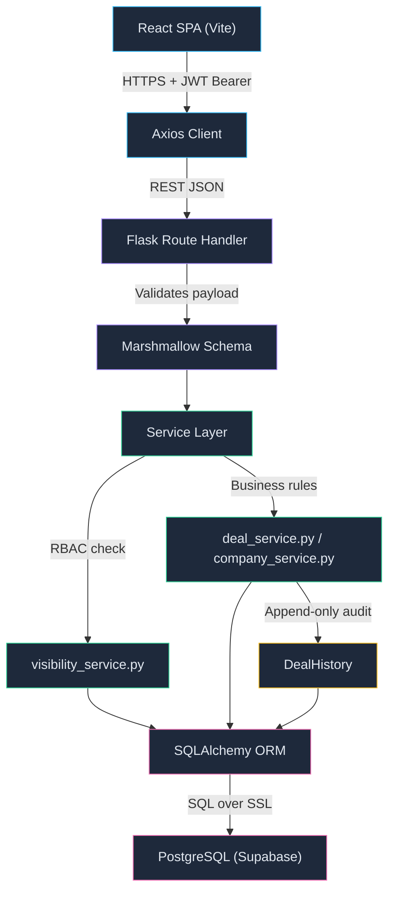

# Architecture

## What are the moving pieces, and how do they talk to each other?

Three components:

* **Frontend:** React 18 SPA (Vite). 6 pages (`LoginPage`, `DashboardPage`, `CompaniesPage`, `DealsPage`, `MyDealsPage`, `AlertsPage`), with shared layout (`AppLayout`, `Sidebar`, `ProtectedRoute`) and an `AuthContext` for session state. All API calls go through a single Axios `client.js` that attaches JWT from `sessionStorage`, measures network latency via `performance.now()`, and logs total render cycle time (network + React reconciliation + paint) in dev mode using `requestAnimationFrame`.

* **Backend:** Python Flask REST API using the app factory pattern (`create_app` in `__init__.py`). Structured into 4 layers — routes, schemas, services, models — with a centralized error handler that catches every exception type (`AppError`, `MarshmallowValidationError`, `IntegrityError`, HTTP 400/404/500) and returns a consistent `{ error: { code, message } }` JSON shape. No raw exception ever leaks to the client.

* **Database:** Managed PostgreSQL (Supabase). All monetary values use `Numeric(15,2)` — no floating-point. Foreign keys, unique indexes, and `pool_pre_ping` for connection health.

### Backend layers

I kept the backend organized into strict layers because I wanted the routes to stay thin and all the real logic to live in one place:

- **Routes (`app/routes/`):** Parse HTTP params, call the right service function, return status codes. No business logic here.
- **Schemas (`app/schemas/`):** Marshmallow schemas validate incoming payloads and strip unknown fields. Same schemas format outbound responses. One source of truth for what a "deal" or "company" looks like in JSON.
- **Services (`app/services/`):** This is where everything important happens. `deal_service.py` (~1200 lines) handles the lifecycle state machine, bulk operations, pagination, CSV export. `visibility_service.py` centralizes who-can-see-what so the same rules apply everywhere. `company_service.py` handles CRUD with duplicate detection. `dashboard_service.py` builds aggregations. `alert_service.py` manages overdue deal logic with date-tracked dismissals.
- **Models (`app/models/`):** SQLAlchemy models with explicit foreign keys, indexes, and constraints. The `DealHistory` model is append-only — it has no update method.
- **Middleware (`app/middleware/`):** `auth.py` provides `@auth_required` and `@manager_required` decorators. `error_handler.py` is the global exception catcher. Both run on every request.
- **Utils (`app/utils/`):** `constants.py` is the single source of truth for stages, transition rules, probabilities, error codes, and sort field allowlists. `exceptions.py` defines typed exceptions (`ValidationError` → 422, `AuthorizationError` → 403, `NotFoundError` → 404, `InternalError` → 500).

The frontend hides buttons a user shouldn't click (e.g., bulk reassign for reps), but the backend independently validates permissions on every single request. The UI is a convenience layer — the server is the authority.

### Security decisions baked into the factory

The app factory does a fail-fast check on startup: if `FLASK_ENV=production` and `SECRET_KEY` or `JWT_SECRET_KEY` is missing or matches a known dev fallback, the server refuses to start. This was a deliberate choice — I'd rather have a deployment fail loudly than silently run production with dev secrets.

CORS is restricted to explicit frontend origins (parsed from `FRONTEND_URL` env var), not a wildcard `*`. JWT error handlers return the same `{ error: { code, message } }` shape as everything else, so the frontend never has to special-case auth failures.

---

## Where does each piece run?

* **Frontend:** Static SPA on **Vercel** (`https://busy-sales-crm.vercel.app`). API URL configured via `VITE_API_URL` env var. Vercel's `vercel.json` rewrites handle SPA routing.
* **Backend:** Docker container on **Google Cloud Run** (`asia-south1`). Images built by **Google Cloud Build**, stored in Artifact Registry. Gunicorn runs with 2 workers × 8 threads, bound to Cloud Run's `$PORT`.
* **Database:** **Supabase** managed PostgreSQL with SSL. Migrations tracked by Alembic (`flask db upgrade`).
* **Heartbeat:** Free-tier Cloud Run scales to zero when idle. I set up a cron job that pings `/api/health` periodically to keep the container warm, so the reviewer doesn't hit a 30-second cold start.

I chose this stack because it keeps infrastructure maintenance at zero — no servers to patch, no database backups to configure — so all my time went into business logic and data integrity.

---

## What is the request path for one representative user action, end to end?

**Example: a sales rep advances a deal from NEW → QUALIFIED.** Here's exactly what happens:

1. **User clicks** "Advance →" on a deal row in the pipeline.
2. **Axios sends** `PATCH /api/deals/{id}/stage` with body `{"stage": "QUALIFIED"}` and the JWT bearer token from `sessionStorage`.
3. **Auth middleware** (`@auth_required`) verifies the JWT signature and loads the `User` object from the database.
4. **Visibility check:** `visibility_service.can_edit_deal(user, deal)` confirms the user is the deal owner, a collaborator, or a manager.
5. **State machine validation:** The service looks up `STAGE_TRANSITIONS["NEW"]` and confirms `QUALIFIED` is in the `forward` list. If the request tried `NEW → PROPOSAL`, it would get rejected with `INVALID_STAGE_TRANSITION` (HTTP 422).
6. **Mutation + audit:** In a single transaction, the deal's stage is updated and an immutable `DealHistory` record is created with `event_type="STAGE_CHANGED"`, `old_value={"stage": "NEW"}`, `new_value={"stage": "QUALIFIED"}`. Both rows commit or neither does.
7. **Response:** HTTP 200 with the updated deal object.
8. **Frontend update:** The deal row updates — full page reload. A toast notification confirms the action.

The same pattern applies to backward moves (mandatory reason captured in history), closures (only from Negotiation), and reopens (manager-only, restores exact `previous_stage`).

---

## What did you decide *not* to build, and why?

* **No public signup.** This is a private CRM, not a SaaS product. User provisioning goes through `POST /api/auth/users` which is gated to managers only. The server hardcodes `SALES_REP` as the role — client-supplied role params are silently ignored.
* **No email verification or password reset.** Useful in production SaaS, but outside the scope here. I'd rather spend the time on getting the lifecycle state machine right.
* **No microservices or message queues.** A single Flask app with PostgreSQL handles everything cleanly. Adding Kafka or splitting into services would add operational complexity without solving any real problem at this scale.
* **No deal restore from trash.** Deleted deals go to a manager-only read-only trash view — you can see what was deleted and why, but you can't undelete it. The spec says companies can be "archived and restored" but deals can only be "created, edited, and deleted." I respected that distinction instead of adding a restore button that felt convenient but wasn't asked for.
